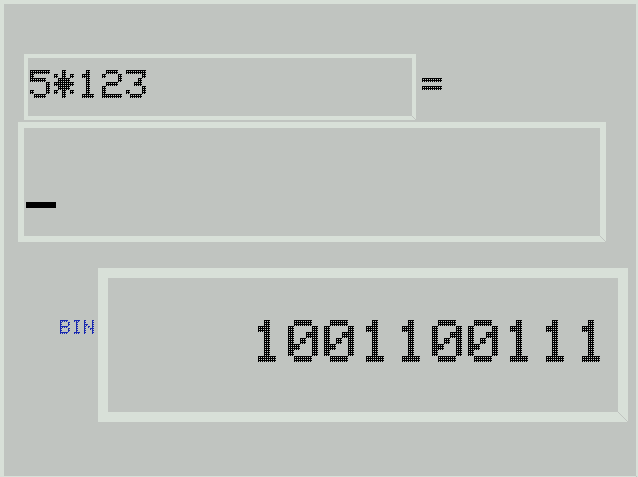
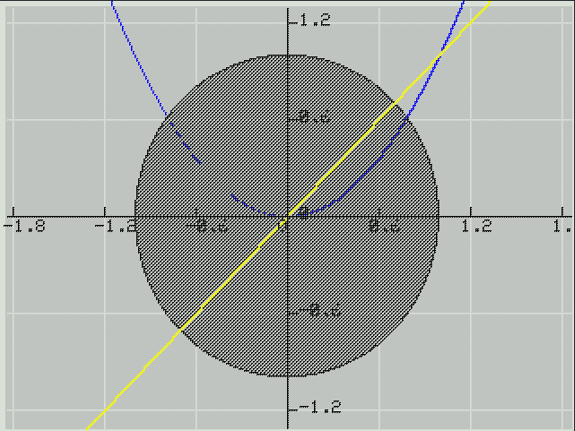
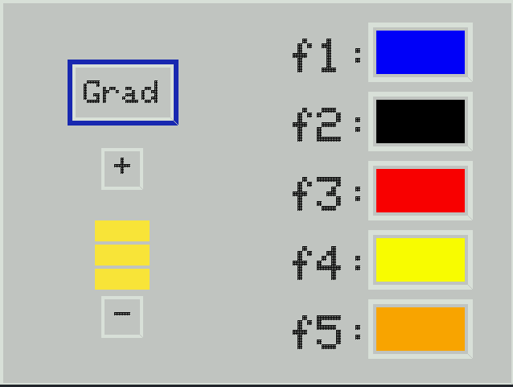

Calculator
==========
This is one of my oldest projects, and as such it is quite bad. I myself don't realy know what exactly is going in.
I wrote it before I had any formal education in computer science or programming. It was originaly developed to be run
on a Arduino compatible microcontroller and was later ported to Visual C++ (This was before my switch to GNU, Linux and FOSS) and SDL.

I have now made the program compile and run using g++ or clang++. I have not changed more than neccesary, and therefore the program
still contains memory leaks, compiling it will generate a lot of warnings and is generaly not programmed well.

## Features?

### Calculator
The calculator is able to do basic operations like `+`, `-`, `*`, `/`, and `^`. It also supports trigonpmetric functions
like for example `sin`, `cos`, or `tan`. There is also the option to output in decimal, octal, hexadecimal or binary.

### Graphing
The calculator is able to graph functions or relations, but relations will be significantly slower to draw, especially on
the original version for the microcontroller.

### Setting
The settings allow changing between degrees and radians and also allow selecting the colors for the graphing.
The brightness setting has no effect on the versions that don't run on a microcontroller, and as such are useless in this port.

